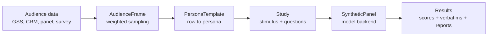

# AudienceKit

[](pyproject.toml)
[](LICENSE)

AudienceKit is a Python library for synthetic audience research grounded in
real respondent rows.

It gives you a small set of composable primitives for turning survey microdata,
customer panels, recruiting lists, or research datasets into weighted synthetic
panels. You define the audience, structure the study, run it through a model
backend, and analyze the output as a directional pressure test before spending
time or budget on fieldwork.

GSS is the first included dataset adapter. The core library is intentionally
dataset-agnostic.

## What You Can Use It For

AudienceKit is useful when you need early, structured audience feedback and you
can tolerate uncertainty.

| Use case | What AudienceKit helps you do |
| --- | --- |
| Market research | Pressure-test positioning, category assumptions, purchase intent, and segment reactions before commissioning a full survey. |
| New product development | Compare product concepts, feature bundles, naming, packaging, or pricing hypotheses across respondent segments. |
| Website analysis | Ask sampled personas to walk through a landing page, note comprehension gaps, objections, and trust signals. |
| Synthetic campaign testing | Compare ads, emails, creative routes, claims, CTAs, and audience-message fit before launching a campaign. |
| Concept and message testing | Run the same instrument across treatment arms, benchmark cells, and audience cuts. |
| Research planning | Turn synthetic responses into sharper hypotheses, screeners, survey items, and moderator-guide probes for human research. |

Use it as a research copilot, not as a substitute for real users. A good run
should make the next human study cheaper, sharper, or more falsifiable.

## Why AudienceKit

Most synthetic-user demos start with imagined personas. AudienceKit starts with
rows.

- **Grounded sampling frames**: sample from real respondent records with optional
  survey weights.
- **Dataset adapters, not dataset lock-in**: GSS ships first, but any DataFrame
  with an id and optional weight column can become an audience.
- **Structured studies**: define stimuli, treatment arms, Likert items, choices,
  and open-ended questions as reusable specs.
- **Provider flexibility**: Gemini is the default backend, with OpenAI,
  Anthropic, and custom backend objects supported.
- **Agent-ready workflows**: included skills help an agent structure surveys and
  browse websites from sampled persona viewpoints.
- **Honest scope**: results are framed as directional signals with documented
  methodological limits.

## Install

For local development:

```bash
git clone https://github.com/lfiaschi/audiencekit.git
cd audiencekit
uv venv
uv pip install -e ".[dev]"
```

Set a model API key. Gemini is the default backend:

```bash
export GEMINI_API_KEY=...
```

`GOOGLE_API_KEY` also works for Gemini. Use `OPENAI_API_KEY` or
`ANTHROPIC_API_KEY` when selecting those backends.

## Quick Start

```python
import audiencekit as ak
from audiencekit.report import likert_summary

pool = ak.load_panel()
respondents = ak.sample_panel(pool, n=50, segment="broad", seed=42)

study = ak.Study.from_dict({
    "title": "Compact EV concept test",
    "stimulus": {
        "description": "A compact electric vehicle designed for city commuters."
    },
    "questions": [
        {
            "id": "fit",
            "type": "likert",
            "text": "How well does this fit your life?"
        },
        {
            "id": "consideration",
            "type": "likert",
            "text": "How likely would you be to consider it?"
        },
        {
            "id": "first_reaction",
            "type": "text",
            "text": "What is your honest first reaction?"
        },
    ],
})

panel = ak.SyntheticPanel(respondents)  # Gemini, gemini-2.5-flash
results = panel.run_survey(study)

print(likert_summary(results, study))
print(results[["respondent_id", "first_reaction"]].head())
```

By default, `ak.load_panel()` prepares the bundled public GSS 2024 Stata file.
For trend work across years, download the full GSS 1972-2024 cumulative file
from NORC and pass it to `ak.load_gss(...)`.

## Default GSS Personas

AudienceKit ships with a default GSS persona renderer. Start here before
customizing prompts:

```python
import audiencekit as ak

pool = ak.load_panel()
row = ak.sample_panel(pool, n=1, seed=13).iloc[0].to_dict()

template = ak.GSS_PERSONA_TEMPLATE
print(template.render(row))
```

`ak.build_persona(row)` is the same default renderer as a convenience function.
Use `ak.GSS_PERSONA_TEMPLATE` when you want the default GSS prompt to look like
the custom `PersonaTemplate` API.

The default GSS persona uses these prepared columns:

```python
ak.GSS_PERSONA_FIELDS
# (
#     "age", "sex", "race_detail", "region", "res16", "born", "marital",
#     "childs", "adults", "sibs", "degree", "madeg", "income16", "class",
#     "wrkstat", "occ10", "prestg10", "finrela", "satfin", "partyid",
#     "polviews", "relig", "relpersn", "attend", "happy", "health",
# )
```

The bundled GSS template intentionally uses broad, high-coverage variables:
each default field is available for at least 70% of the prepared 2024 panel.
When several variables have similar meaning, AudienceKit uses one pragmatic
field: for example, `income16` instead of the compressed historical `income`,
`race_detail` from `RACECEN1` instead of the three-category `RACE`, and
`relig` instead of stacking multiple religion-category fields. The default
prompt intentionally omits some available high-coverage columns, such as
`earnrs`, `weekswrk`, `wrkslf`, and `natsoc`, because they made general-purpose
consumer personas sound contradictory or too policy-specific.

Under the hood, the GSS row is rendered with this template:

```text
You are a {age} year old {sex} adult living in the {region} region of the United States.
You describe your race or ethnicity as {race_detail}; you were {born}, and you were raised {res16}.
You are {marital}, have {childs} children, and your household has {adults}.
You had {sibs}. Your highest degree is {degree}; your mother's highest degree was {madeg}.
Your reported family income last year before taxes was {income16}, from all family sources, not just salary.
You describe your social class as {class}.
Your labor-force status is {wrkstat}. Your current or most recent occupation area is {occ10} (occupational prestige: {prestg10}).
Compared with other households, your financial situation is {finrela}; financial satisfaction: {satfin}.
Politically you identify as {partyid} and consider yourself {polviews}.
Your religious preference is {relig}; you describe yourself as {relpersn}, and you attend services {attend}.
You describe yourself as {happy} overall and your health as {health}.
```

The `income16` field is the GSS expanded current-family-income card. AudienceKit
renders it as reported family income from all family sources, not as salary.
The 2024 GSS `REGION` field is rendered with its current four-category coding
(`Northeast`, `Midwest`, `South`, `West`). Missing non-core fields render as
`not reported`.

## How It Works



The library keeps the moving parts explicit:

1. Load or prepare a respondent frame.
2. Sample rows, optionally with survey weights and segment filters.
3. Render each row into a persona prompt.
4. Run a structured study through an LLM backend.
5. Analyze the resulting table with ordinary Python tools.

## Use-Case Patterns

### Market Research

Run benchmarked concept tests with fixed stimuli and reusable instruments:

```python
luxury = ak.sample_panel(pool, n=200, segment="luxury", seed=7)
study = ak.Study.from_json("examples/ferrari_luce/study.json")
results = ak.SyntheticPanel(luxury).run_survey(study)
```

This pattern is strongest when you compare cells: concept A vs. concept B,
current positioning vs. challenger positioning, or a target segment vs. a broad
reference panel.

### New Product Development

Use treatment descriptions to compare feature bundles, names, claims, or price
frames. The core runner executes one stimulus at a time; loop over
`study.treatments` yourself or use `scripts/run_survey.py --treatment NAME` as
the reference pattern.

```python
study = ak.Study.from_dict({
    "title": "Feature bundle test",
    "stimulus": {"description": "The product automates weekly reporting."},
    "treatments": {
        "baseline": "The product automates weekly reporting.",
        "premium": "The product automates reporting and adds executive-ready forecasts."
    },
    "questions": [
        {"id": "value", "type": "likert", "text": "How valuable is this?"},
        {"id": "objection", "type": "text", "text": "What would stop you from trying it?"},
    ],
})
```

### Website Analysis

Use the `skills/persona-browse` workflow with a browsing-capable agent to sample
one persona, visit a page, and record what that persona understands, trusts,
misses, and objects to. This is useful for landing pages, product pages, pricing
pages, and competitor audits.

### Synthetic Campaign Testing

Represent each ad, email, or landing-page claim as a stimulus. Keep the audience
and questions fixed, vary the creative, and compare relative lift plus the
language of objections:

```python
campaign_study = ak.Study.from_dict({
    "title": "Campaign message test",
    "stimulus": {"description": "Ad headline: Save hours every week on budget reviews."},
    "questions": [
        {"id": "clarity", "type": "likert", "text": "How clear is this message?"},
        {"id": "relevance", "type": "likert", "text": "How relevant is this to you?"},
        {"id": "rewrite", "type": "text", "text": "How would you say this in your own words?"},
    ],
})
```

## Model Backends

AudienceKit supports Gemini, OpenAI, Anthropic, and custom backend objects.
Gemini with `gemini-2.5-flash` is the default:

```python
panel = ak.SyntheticPanel(respondents)
```

Select another managed backend:

```python
panel = ak.SyntheticPanel(respondents, backend_type="openai", model="gpt-4o-mini")
panel = ak.SyntheticPanel(respondents, backend_type="anthropic")
```

Pass a custom backend for local models, eval doubles, or another provider:

```python
class MyBackend:
    def get_completion(self, prompt, image=None, **kwargs):
        return call_my_model(prompt, image=image, **kwargs)

panel = ak.SyntheticPanel(respondents, backend=MyBackend())
```

## Extending Datasets

AudienceKit is built around primitives so new datasets can be added as adapters.
An adapter should return a `pandas.DataFrame` with:

- one row per audience member
- a stable id column
- an optional positive weight column
- human-readable attributes that can be rendered into a persona

```python
import pandas as pd
import audiencekit as ak

customers = pd.read_csv("customer_panel.csv")

frame = ak.AudienceFrame(
    customers,
    id_column="customer_id",
    weight_column="survey_weight",
)

respondents = frame.sample(
    n=100,
    segment=lambda row: row["country"] == "US" and row["category"] == "software",
    segment_name="us_software_buyers",
    seed=11,
)

template = ak.PersonaTemplate(
    "You are {age}, based in {country}, work in {role}, "
    "and currently buy {category} tools. Your budget authority is {budget_owner}."
)

panel = ak.SyntheticPanel(respondents, persona_template=template)
results = panel.run_survey(study)
```

Recommended adapter shape:

```python
def load_my_panel(path):
    raw = read_my_source(path)
    cleaned = clean_labels_and_missing_values(raw)
    return cleaned.rename(columns={
        "respondent_id": "id",
        "survey_weight": "weight",
    })
```

Keep dataset-specific cleaning, labels, and missing-value rules in the adapter.
Keep `AudienceFrame`, `PersonaTemplate`, `Study`, and `SyntheticPanel`
dataset-neutral.

## GSS Adapter

`ak.load_panel()` loads the bundled GSS 2024 public-use Stata file and prepares
it as an AudienceKit persona frame. This keeps examples self-contained without
committing a derived row-level CSV.

For production trend studies, download the full General Social Survey
1972-2024 cumulative file from NORC and prepare a weighted persona frame:

```python
pool = ak.load_gss("path/to/GSS_stata.zip", years=[2024])
respondents = ak.sample_panel(pool, n=600, weighted=True, seed=42)
```

`audiencekit.gss` reads `.dta`, zipped Stata, CSV, and Parquet inputs; maps
selected GSS codes to readable labels; preserves the GSS survey weight as
`weight`; and keeps missing non-core persona attributes as `not reported` rather
than dropping those respondents.

For GSS personas, AudienceKit uses `INCOME16` as the single default income
field. It is rendered as reported family income last year before taxes, from all
family sources, not as salary.

## Skills

AudienceKit includes two optional agent skills in `skills/`:

- `skills/survey/`: turn a research brief into a structured study spec, sample
  an audience frame, run a panel, and summarize directional findings.
- `skills/persona-browse/`: sample one persona and run a short qualitative
  website walkthrough in that persona's voice.

Copy or symlink these folders into your agent's skill directory, or point your
agent runtime at this repository's `skills/` directory if repo-local skills are
supported. The skills are workflow guides; the Python API remains the source of
truth.

## Customizing Prompts

Customize persona rendering with `PersonaTemplate`:

```python
template = ak.PersonaTemplate(
    "You are {age}, live in {region}, shop for {category}, "
    "and describe price sensitivity as {price_sensitivity}."
)

panel = ak.SyntheticPanel(respondents, persona_template=template)
```

For full control, pass a `prompt_builder(row, study_dict)` callable. This
replaces AudienceKit's default survey prompt while keeping sampling, backend
calls, parsing, and report utilities:

```python
def prompt_builder(row, study):
    return f"""
You are responding as this audience member:
age={row["age"]}, segment={row["segment"]}

Answer this study as JSON with these fields:
{[q["id"] for q in study["questions"]]}
"""

panel = ak.SyntheticPanel(respondents, prompt_builder=prompt_builder)
```

## Examples

- `examples/ferrari_luce/` contains a Ferrari Luce concept-test study spec,
  stimulus assets, and a notebook-style walkthrough.
- `scripts/run_survey.py` runs a study spec against a sampled panel.
- `scripts/extract_panel.py` prepares a GSS panel from a downloaded GSS file.
- `scripts/analyze_ferrari.py` shows a small analysis/report workflow.

The Python API is the primary interface. The scripts are intentionally small so
they can be copied, modified, or replaced in project-specific research repos.

## Methodological Grounding

Synthetic audience research is moving quickly, and the open-source community is
rightly skeptical of tools that promise to replace human evidence. AudienceKit
takes the narrower position: synthetic panels are useful for structured
hypothesis generation, comparison, and research planning when the sampling
frame, model, prompt, stimuli, and limitations are visible.

Recommended reading:

- [LLMs Reproduce Human Purchase Intent via Semantic Similarity Elicitation of Likert Ratings](https://arxiv.org/abs/2510.08338)
  introduces semantic similarity rating (SSR), where models produce text first
  and ratings are mapped from embedding similarity to reference statements. The
  paper reports stronger purchase-intent replication than direct numeric
  Likert prompting.

AudienceKit v0.1 keeps direct structured Likert questions because they are
simple, inspectable, and useful for within-run pressure tests. Treat SSR-style
text-first scoring as a stronger validation direction for future adapters or
custom backends, not as a feature this release already implements.

When reporting results, be precise:

- Claims are conditional on the model, prompt, stimuli, and audience frame.
- Synthetic confidence intervals are not human survey sampling intervals.
- Benchmark/reference cells are safer than interpreting raw scores in isolation.
- Open-ended text is often more useful than compressed Likert numbers.
- A good synthetic run sharpens a human study; it should not replace one.

## Development

```bash
uv run --extra dev python -m pytest tests
```

The Apache License 2.0 covers AudienceKit code. Bundled sample data and example
assets are documented separately in `NOTICE.md` and should be treated according
to their source terms.
